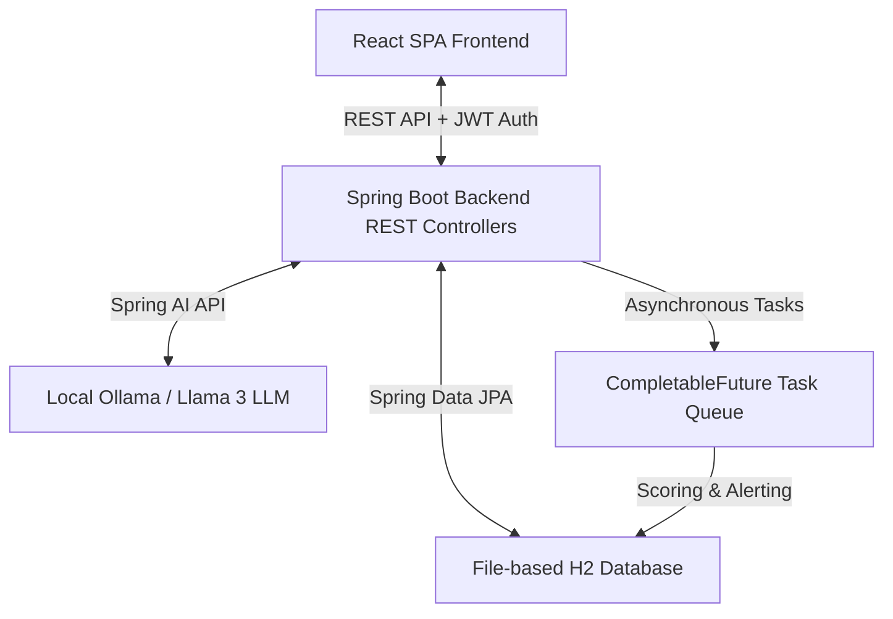

# 💎 NovaBank - Intelligent Smart Banking Platform

NovaBank is an enterprise-grade private banking intelligence dashboard and smart transaction analytics platform. The application combines a premium, highly responsive user interface with a robust Spring Boot backend powered by local Artificial Intelligence to analyze transaction flows, assess financial health, score fraud risks, and deliver actionable wealth advisory recommendations.

---

## 🏗️ Architecture & Core Tech Stack

NovaBank is built on a modern decoupled architecture, combining a reactive/interactive React frontend with a secure, transactional Java backend.



### 🖥️ Backend & AI Orchestration
* **Language Runtime:** Java 22
* **Core Framework:** Spring Boot 3.4.1 (Spring Web, Spring Security 6, Spring Data JPA)
* **AI Integration:** Spring AI with Ollama Client (running **Llama 3** locally on port `11434`)
* **Database & Persistence:** H2 Database Engine utilizing file-based storage (`jdbc:h2:file:./data/novabankdb`) for session persistence across restarts.
* **Authentication:** Stateless JWT (JSON Web Token) authentication with custom filter chain execution.

### 🎨 Frontend & Design System
* **Runtime Framework:** React 18
* **Build System:** Vite 5
* **Styling Framework:** Tailwind CSS 3
* **Visualizations:** Recharts (responsive line charts, area charts, and categorical transaction breakdowns)
* **Aesthetic Theme:** Premium high-contrast light-blue and white gradient interface using glassmorphic design elements, unified status indicators, and smooth micro-animations.

---

## 🌟 Key Features & Capabilities

### 🧠 1. AI Portfolio Diagnostics & Financial Intelligence
Using an active integration with a local **Llama 3** LLM, NovaBank parses the user's spending habits, income flows, and balance histories to:
* Generate a monthly **AI Financial Advisory Report**.
* Calculate interactive metrics like the **Savings Rate Score** and **Spending Optimization Score**.
* Produce a dynamic **AI Action Checklist** containing tailored next steps for debt consolidation, investment opportunities, or budget rebalancing.

### ⚡ 2. Asynchronous Fraud & Anomaly Detection
Every new transaction created in the system triggers an asynchronous analytical pipeline using Spring's task executor:
* Queries the local LLM concurrently without blocking the client transaction request.
* Conducts semantic analysis on the transfer descriptions and amount categories to generate a **Fraud Risk Score**.
* Automatically logs database-level **Critical Alerts** if suspicious activity or anomalous transfers are detected.

### 📊 3. Interactive Cash Flow Analytics
* **Dynamic Time-Series Charts:** Tracks deposit and withdrawal trends with color-coordinated area overlays.
* **Category Breakdown:** Interactive circular distribution mapping out primary expenditure outlets (e.g., Food, Entertainment, Utilities, Rent).
* **AI Diagnostics View:** Dedicated diagnostic center containing real-time reports from the intelligent advisor.

### 💸 4. Transactional Peer-to-Peer Transfers
* **Dual-Debit Operations:** Wire transfers and internal account balances are updated under strict `@Transactional` boundaries, guaranteeing ACID compliance and prevention of race conditions.
* **Intuitive Directory Routing:** Instant lookup and transfers to other users registered on the platform.

---

## 📂 System Directory Structure

```text
novabank/
├── backend/
│   ├── src/main/java/com/novabank/
│   │   ├── NovaBankApplication.java
│   │   ├── config/             # Security, Spring AI, and task executor configurations
│   │   ├── controller/         # REST API Controllers (Auth, Account, Transaction, AI Analytics)
│   │   ├── service/            # Core business logic & Ollama Llama 3 ChatModel integration
│   │   ├── repository/         # JPA database repositories
│   │   ├── model/              # Persistence models (User, Transaction, AIReport, Alert)
│   │   ├── security/           # JWT utility classes, stateless filter filters
│   │   ├── enums/              # Typed constants (TransactionType, Category, AlertLevel)
│   │   └── exception/          # Global API exception handling and response advice
│   └── src/main/resources/
│       └── application.properties  # Database, Server ports, and Ollama configuration
└── frontend/
    ├── src/
    │   ├── components/         # Reusable charts, UI cards, and status components
    │   ├── pages/              # Primary view routings (Dashboard, Analytics, Login, Register)
    │   ├── services/           # HTTP Axios config wrappers and REST service APIs
    │   ├── context/            # Global AuthContext state provider
    │   └── App.jsx             # Switchboard React router
    ├── index.html
    ├── tailwind.config.js
    └── vite.config.js
```

---

## 🔒 Technical Design Highlights

* **Local Inference Security:** By leveraging local Ollama installations, transaction data is analyzed locally within your environment without transferring sensitive financial records to external cloud LLM APIs.
* **Persistent Local Storage:** The application uses a local file-based database store in the backend directory. This ensures accounts, custom transactions, registered users, and system alerts persist across server crashes or restarts.
* **Non-Blocking User Experience:** AI diagnostics and risk profiling run on dedicated thread pools, returning transaction confirmations to the client instantly while the audit logs update asynchronously in the background.
